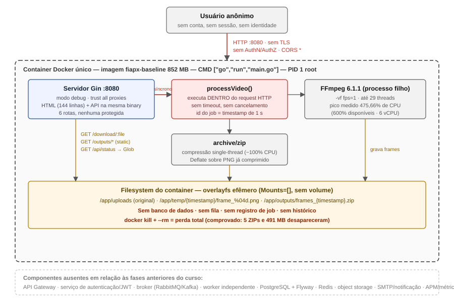
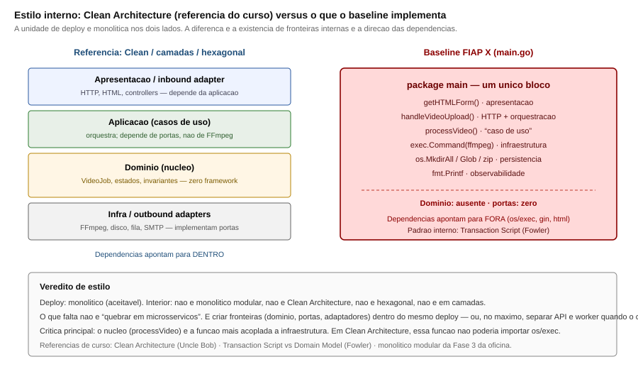
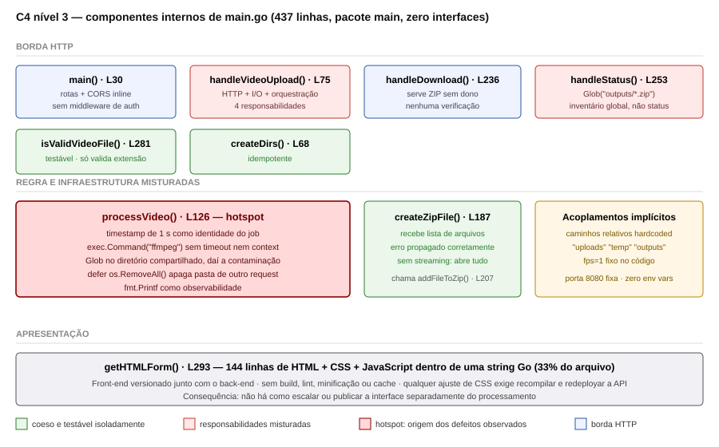
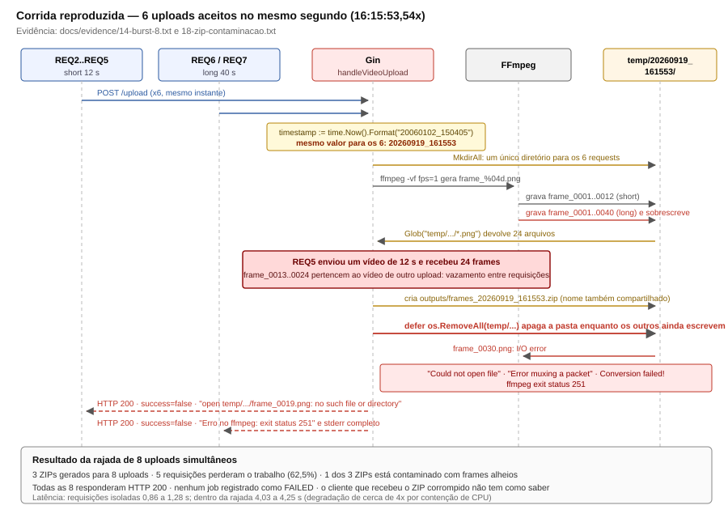
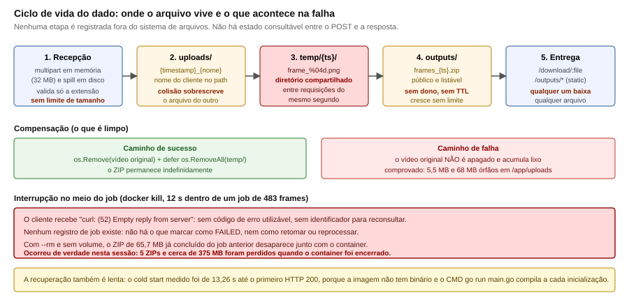
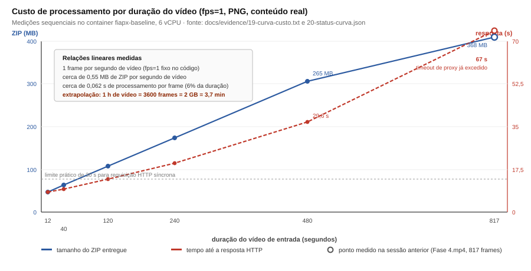
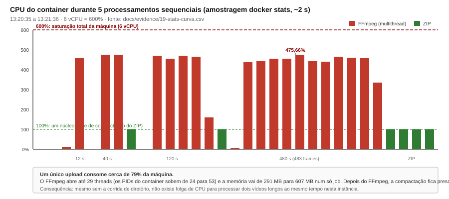
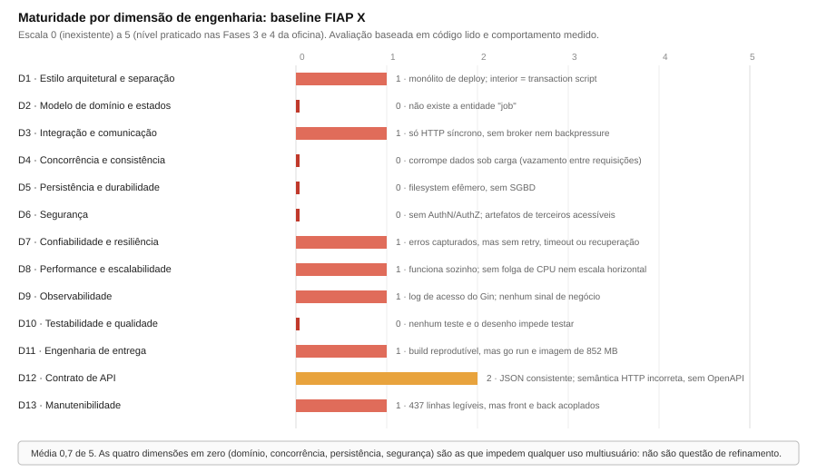

# Deep dive de engenharia: baseline FIAP X

**Diagnóstico técnico do protótipo de processamento de vídeos apresentado aos investidores**

| Campo | Valor |
|-------|-------|
| **Objeto da análise** | `projeto-fiapx/`: `main.go` (437 linhas), `Dockerfile`, `go.mod`, `go.sum` |
| **Natureza do artefato** | Protótipo funcional de demonstração; o próprio `Dockerfile` se declara "exemplo de como NÃO fazer" |
| **Objetivo deste documento** | Avaliar o sistema atual contra práticas de engenharia, arquitetura, segurança e qualidade |
| **O que este documento não é** | Não é comparação com uma solução proposta, nem justificativa de reescrita. A proposta de evolução será registrada separadamente em ADR |
| **Data das medições** | 19/09/2026, 12:34 – 13:36 (UTC−3) |
| **Ambiente** | Windows 10 · Docker Desktop 29.8.0 (WSL2) · Intel i5-8400 6 vCPU · 8,28 GB RAM |
| **Runtime medido** | Imagem `fiapx-baseline` · Go 1.21.13 · Gin 1.9.1 · FFmpeg 6.1.1 (Alpine) |
| **Evidências** | `docs/evidence/` (26 artefatos) · diagramas em `docs/diagrams/` |

---

# Parte I: Enquadramento

## 1. Sumário executivo

Com um vídeo por vez o baseline funciona. `POST /upload` grava o arquivo, o FFmpeg extrai 1 quadro por segundo e a resposta devolve o ZIP. Um vídeo de 12 segundos levou 0,91 s.

Com dois uploads no mesmo segundo, o código mistura os arquivos. Na rajada de oito uploads, quem mandou um vídeo de 12 segundos recebeu um ZIP com 24 PNGs. Doze eram do vídeo de outra pessoa. As oito respostas foram HTTP 200. O detalhe está na seção 6.

O ponto do bug está em `projeto-fiapx/main.go`, linha 94, dentro de `handleVideoUpload`:

```94:96:projeto-fiapx/main.go
	timestamp := time.Now().Format("20060102_150405")
	filename := fmt.Sprintf("%s_%s", timestamp, header.Filename)
	videoPath := filepath.Join("uploads", filename)
```

`20060102_150405` é ano, mês, dia, hora, minuto e segundo. Não tem milissegundo nem id. Dois requests no mesmo segundo ficam com a mesma string, por exemplo `20260919_161553`. Essa string é usada em quatro caminhos:

| Linha | O que o código faz | O que quebra |
|-------|--------------------|--------------|
| 96 | Salva o vídeo em `uploads/{timestamp}_{nome}` | Dois uploads do mesmo nome no mesmo segundo gravam o mesmo arquivo. O segundo apaga o primeiro. |
| 117 | Passa esse `timestamp` para `processVideo` | Os dois jobs passam a operar no mesmo identificador. |
| 129–133 | Cria `temp/{timestamp}/frame_%04d.png` | Os dois FFmpeg escrevem `frame_0001.png`, `frame_0002.png` na mesma pasta. Um sobrescreve o outro. |
| 160 | Grava `outputs/frames_{timestamp}.zip` | O ZIP de um substitui o ZIP do outro. Quem termina por último fica com a mistura. |

Na linha 131, `defer os.RemoveAll(tempDir)` apaga `temp/{timestamp}` quando o primeiro request acaba. Se o outro FFmpeg ainda está gravando, o diretório some no meio. Foi o erro `Could not open file : temp/20260919_161553/frame_0030.png`.

As outras falhas medidas, no mesmo código:

**Sem login.** Nenhuma das seis rotas pede usuário. `GET /api/status` lista os ZIPs de todo mundo. `GET /uploads/...` devolve o vídeo original. Baixamos um MP4 de 5,7 MB com HTTP 200, sem credencial.

**Sem banco.** Não há Postgres nem volume. Os arquivos moram no disco do container. Ao encerrar o processo, 5 ZIPs (cerca de 375 MB) sumiram e `/api/status` voltou a `{"files":null,"total":0}`.

**Sem id para retomar.** `docker kill` aos 12 s de um job de 483 quadros devolveu `curl: (52) Empty reply from server`. Não existe registro para marcar falha ou reprocessar. O cold start medido foi 13,26 s porque o `Dockerfile` usa `go run`, e a imagem recompila a cada boot.

**CPU.** Um upload sozinho chegou a 475,66% de CPU numa máquina de 600% (6 vCPU), cerca de 79% do host. Dois vídeos longos ao mesmo tempo não cabem. O ZIP cresce cerca de 0,55 MB por segundo de vídeo, sem cota. Uma hora de vídeo vira cerca de 2 GB.

O arquivo inteiro está em `package main`. Não há domínio, porta nem worker. A classificação está na seção 4.1. Nas 13 dimensões da Parte III a média é **0,7 de 5**. Domínio, concorrência, persistência e segurança ficaram em zero. Sem isso o sistema não atende mais de um usuário.

## 2. Metodologia e limites da análise

A avaliação combinou quatro técnicas, nesta ordem:

**Leitura estática do código.** Mapeamento das 10 funções de `main.go`, das dependências declaradas e do `Dockerfile`, identificando responsabilidades, acoplamentos e pontos de decisão arquitetural.

**Execução e observação do caminho feliz.** Construção da imagem, execução do container e uso da interface web com vídeos reais, registrando os logs de acesso do Gin e as saídas do processo.

**Testes dinâmicos dirigidos.** Experimentos desenhados para exercitar dimensões específicas: concorrência (2 e 8 uploads simultâneos), validação de entrada (arquivo com extensão falsa), controle de acesso (requisições sem credencial, tentativas de travessia de caminho), consumo de recursos (amostragem de `docker stats`), custo por duração (cinco vídeos de 12 s a 480 s) e resiliência (interrupção no meio do processamento).

**Inspeção do artefato de execução.** Análise das camadas da imagem, configuração do container, usuário efetivo, healthcheck, variáveis de ambiente e conteúdo do sistema de arquivos durante e após os testes.

Os vídeos de longa duração foram produzidos com `ffmpeg -stream_loop` a partir de uma das amostras reais, preservando características de codificação e, portanto, o tamanho realista dos PNGs extraídos.

### Limites que devem ser considerados na leitura

Estas restrições delimitam o alcance das conclusões:

- **Amostra de hardware única.** Todas as medições vêm de uma máquina (6 vCPU, 8,28 GB) sob Docker Desktop/WSL2. Os números absolutos variam em outro hardware; as **relações** (linearidade do custo, proporção de CPU, taxa de colisão) são propriedades do desenho e se mantêm.
- **Sem limites de recurso aplicados.** O container rodou sem `--cpus` ou `--memory`. Em Kubernetes com limites definidos, a saturação apareceria como *throttling* ou *OOMKill* em vez de consumo de 79% do host.
- **Concorrência gerada localmente.** A rajada partiu da mesma máquina que hospeda o serviço, o que adiciona contenção de CPU do lado do cliente. Isso afeta a latência medida na rajada, não a ocorrência das colisões.
- **A corrida só acontece no mesmo segundo.** REQ0 e REQ1 caíram em segundos diferentes e devolveram o ZIP certo. REQ2 a REQ7 caíram em `20260919_161553` e falharam ou misturaram frames. Quanto mais uploads por segundo, mais colisões. Em produção o bug aparece de vez em quando e some no teste seguinte.
- **Travessia de caminho não foi reproduzida.** As tentativas contra `/download` e `/outputs` retornaram 404. Este relatório não afirma existir leitura arbitrária de arquivos.

## 3. Inventário do sistema

### 3.1 Código

| Métrica | Valor |
|---------|-------|
| Arquivos de código | 1 (`main.go`) |
| Linhas totais | 437 |
| Funções | 10, todas no pacote `main` |
| Interfaces declaradas | 0 |
| Linhas de HTML/CSS/JS embutidas em string Go | 144 (33% do arquivo, a partir da linha 293) |
| Arquivos de teste | 0 |
| Dependência direta | `github.com/gin-gonic/gin v1.9.1` |
| Módulos no grafo (`go.sum`) | 36 |
| Configuração externalizada | Nenhuma variável de ambiente lida pelo código |

Distribuição das funções:

| Linha | Função | Responsabilidades acumuladas |
|-------|--------|------------------------------|
| 30 | `main()` | rotas, CORS inline, arranque |
| 68 | `createDirs()` | criação dos diretórios de trabalho |
| 75 | `handleVideoUpload()` | parsing HTTP, gravação em disco, orquestração, resposta |
| 126 | `processVideo()` | nome do trabalho, invocação do FFmpeg, coleta de quadros, empacotamento, log |
| 187 | `createZipFile()` | criação do arquivo ZIP |
| 207 | `addFileToZip()` | escrita de uma entrada |
| 236 | `handleDownload()` | entrega do artefato |
| 253 | `handleStatus()` | varredura do diretório de saída |
| 281 | `isValidVideoFile()` | verificação de extensão |
| 293 | `getHTMLForm()` | interface web completa |

### 3.2 Superfície HTTP

Seis rotas, nenhuma protegida:

| Método | Rota | Comportamento | Autenticação |
|--------|------|---------------|--------------|
| GET | `/` | HTML embutido no binário | Não |
| POST | `/upload` | Upload + FFmpeg + ZIP no mesmo request | Não |
| GET | `/download/:filename` | Envia ZIP de `outputs/` | Não |
| GET | `/api/status` | `Glob("outputs/*.zip")`. Inventário global | Não |
| GET | `/uploads/*filepath` | Serve estaticamente os **vídeos enviados** | Não |
| GET | `/outputs/*filepath` | Serve estaticamente os ZIPs | Não |

Cabeçalhos de resposta observados em `GET /`:

```
Access-Control-Allow-Origin: *
Access-Control-Allow-Methods: POST, GET, OPTIONS
Access-Control-Allow-Headers: Content-Type
Content-Type: text/html
```

Não há `Authorization`, cookie de sessão, `Content-Security-Policy`, `X-Content-Type-Options` nem HTTPS.

### 3.3 Artefato de execução

| Propriedade | Valor observado |
|-------------|-----------------|
| Tamanho da imagem | **852 MB** |
| Base | `golang:1.21-alpine` (SDK completo, não runtime) |
| Camadas relevantes | 256 MB (toolchain Go) · 237 MB (`go mod tidy`) · 129 MB (FFmpeg) · 8,46 MB (Alpine) |
| Comando de entrada | `CMD ["go","run","main.go"]`. Compila a cada inicialização |
| Usuário efetivo | vazio → **root** |
| Healthcheck | `null` |
| Multi-stage build | Não |
| Volumes | `Mounts=[]` |
| Política de reinício | `no` |
| Conteúdo acidental | diretório `__MACOSX` com 7 arquivos `._*` empacotados na imagem |
| Cold start até HTTP 200 | **13 260 ms** |
| Consumo em repouso | 202,3 MB / 19 PIDs |

O `Dockerfile` roda `go mod tidy` no build e o processo é `go run main.go`. Isso deixa a imagem em 852 MB e o cold start em 13,26 s.

---

# Parte II: Arquitetura as-is

## 4. Visão de container

Todo o sistema é um processo dentro de um container. Não existe segundo serviço, banco, broker, cache, armazenamento de objetos ou componente de notificação.



Três coisas nesse desenho explicam as falhas abaixo.

**O FFmpeg roda dentro do `POST /upload`.** `handleVideoUpload` só responde depois de `processVideo` terminar (linha 117, e o `c.JSON` na linha 123). O navegador fica esperando. Não existe `202`, id de job nem `GET` para consultar depois. Um vídeo de ~13,6 minutos segurou a conexão por 67 s.

**Os diretórios são o banco.** `uploads/`, `temp/` e `outputs/` são o único estado. O container sobe com `Mounts=[]`. Matar o container apaga os ZIPs.

**A página e o FFmpeg estão no mesmo binário.** `getHTMLForm()` (linha 293) é uma string Go de 144 linhas. Mudar um botão exige recompilar o processo que roda o FFmpeg.

## 4.1 Classificação do estilo arquitetural

O baseline é um processo só. O problema não é “faltam microsserviços”. O problema é que esse processo não separa HTTP, job e FFmpeg.

### Um processo, um container

O deploy é um monólito:

- um repositório, um módulo Go (`video-processor`), um `main`;
- um container, um PID, uma porta;
- UI, API e FFmpeg no mesmo artefato.

A oficina da Fase 3 também era um monólito (`oficina-api`) e mesmo assim tinha domínio, Flyway e fronteiras internas. O que falta aqui é essa separação dentro do processo.

| Conceito | O que significa | O baseline |
|----------|-----------------|------------|
| **Monólito de deploy** | Um artefato, um processo | **Sim**. E isso é aceitável para o tamanho do problema |
| **Monólito modular** | Mesmo deploy, módulos com contratos e ownership | **Não**. Não há módulos |
| **Microsserviços** | Serviços com ciclo de vida, banco e deploy próprios | **Não**. Um processo basta neste tamanho. O furo é interno |

Quebrar as 437 linhas em três repositórios, sem separar as funções, só espalha o mesmo script. O que falta é a estrutura interna.

### Estrutura interna: *transaction script*, não modelo de domínio

Martin Fowler descreve dois padrões de organização da lógica:

- **Transaction Script**. Um procedimento por operação, que lê entrada, executa passos e devolve resultado. É o que `handleVideoUpload` + `processVideo` fazem: um roteiro linear (receber → gravar → ffmpeg → zip → responder).
- **Domain Model**. Entidades com identidade, invariantes e transições; a aplicação orquestra, o domínio decide o que é válido.

Não existe `VideoJob`. Não existe regra do tipo “um trabalho pertence a um usuário” nem estado `UPLOADED`, `PROCESSING`, `READY`, `FAILED`. `VideoRequest` está declarado e nenhum handler usa. `ProcessingResult` só carrega a resposta HTTP. A corrida do timestamp acontece porque o código não tem id de job: os dois requests entram na mesma pasta.

### Clean Architecture: não atende

A regra de dependência de Uncle Bob exige que o domínio não conheça framework, I/O nem UI; casos de uso dependem de **portas**; adaptadores implementam as portas na borda.

Mapeamento das camadas sobre o código real:

| Camada (Clean / oficina) | O que deveria existir | O que existe no `main.go` |
|--------------------------|----------------------|---------------------------|
| **Domínio** | `VideoJob`, estados, invariantes | Ausente |
| **Aplicação** | caso de uso “processar vídeo”, portas | Ausente. O handler *é* o caso de uso |
| **Adaptador de entrada** | HTTP / HTML | `handleVideoUpload`, `getHTMLForm` **no mesmo arquivo** |
| **Adaptador de saída** | FFmpeg, disco, e-mail | `exec.Command` e `os.*` **dentro** de `processVideo` |

`processVideo` importa `os/exec`, chama `exec.Command("ffmpeg", ...)` e `os.MkdirAll`, e escreve com `fmt.Printf`. Não existe `type VideoProcessor interface`. Trocar o FFmpeg, gravar em S3 ou publicar numa fila exige editar essa função.

### Arquitetura em camadas e hexagonal: camadas colapsadas

Uma arquitetura em camadas clássica (apresentação → aplicação → domínio → infraestrutura) exigiria pelo menos pacotes ou diretórios. Hexagonal (ports & adapters) exigiria o domínio no centro e adaptadores plugáveis.

No baseline as quatro camadas **colapsam em uma**:

```
apresentação (HTML string)
        │
aplicação (orquestração no handler)
        │          ← tudo no pacote main
domínio (inexistente)
        │
infra (ffmpeg, filesystem, log)
```

Não há pacote `domain`, `application` nem `adapter`. `processVideo()` (linha 126) é quem chama o FFmpeg, lê o disco e monta o ZIP.



### Checklist de padrões

| Padrão | Atende? | Por quê |
|--------|---------|---------|
| Monólito de deploy | **Sim** | Um processo, um artefato |
| Monólito modular | Não | Sem módulos, sem contratos internos |
| Clean Architecture | Não | Sem domínio e sem porta. `processVideo` chama `os/exec` |
| Camadas (n-tier) | Não | Camadas colapsadas no `package main` |
| Hexagonal / ports & adapters | Não | Zero interfaces |
| MVC / separação UI | Não | HTML/CSS/JS embutidos na API |
| Microsserviços | Não | Um bounded context implícito, um deploy |
| Orientado a eventos / mensageria | Não | HTTP síncrono é o único estilo |
| CQRS | Não | Mesmo caminho lê e escreve; “status” é `Glob` no disco |
| Saga / orquestração de processo | Não | Não há processo de longa duração modelado |

### O que falta no código

1. **Não há job.** Sem entidade e sem estado, não há onde gravar dono, idempotência nem “qual o status do meu vídeo”. Mais uma rota HTTP não cria isso.
2. **FFmpeg, disco e HTTP estão na mesma função.** `handleVideoUpload` (linha 75) recebe o arquivo e chama `processVideo` (linha 117). Fila, worker ou S3 significam reescrever essas duas funções.
3. **Tudo roda no mesmo PID.** Um upload mediu ~79% da CPU do host. Não há módulo separado para escalar só o processamento.

Um monólito com domínio, portas e worker interno resolve o problema deste tamanho. Microsserviço não é o que falta.

## 5. Visão de componentes



O arquivo se lê fácil. As falhas estão em duas funções.

`handleVideoUpload()` (linha 75) faz quatro coisas seguidas: lê o multipart, grava em `uploads/`, chama o processamento e monta o JSON. `processVideo()` (linha 126) escolhe a pasta pelo timestamp, chama o FFmpeg, lista os PNGs, cria o ZIP e imprime o log. A corrida, o vazamento e o HTTP 200 saem dessas duas funções.

`isValidVideoFile()`, `createZipFile()` e `addFileToZip()` recebem argumento e devolvem erro. Dá para testar as três sozinhas. O caminho do upload não usa esse formato.

Não existe `type X interface`. O binário está fixo em `exec.Command("ffmpeg", ...)`, os diretórios `"uploads"`, `"temp"` e `"outputs"` são string no código, `fps=1` é fixo e a porta é `8080`.

## 6. O comportamento sob concorrência

O Gin atende cada `POST /upload` numa goroutine. Não há mutex, lock de arquivo nem id. Se dois requests caem no mesmo segundo, os dois entram no bloco abaixo com o mesmo `timestamp`.



```126:133:projeto-fiapx/main.go
func processVideo(videoPath, timestamp string) ProcessingResult {
	fmt.Printf("Iniciando processamento: %s\n", videoPath)

	tempDir := filepath.Join("temp", timestamp)
	os.MkdirAll(tempDir, 0755)
	defer os.RemoveAll(tempDir)

	framePattern := filepath.Join(tempDir, "frame_%04d.png")
```

`os.MkdirAll` na mesma pasta não falha: o segundo request reusa o diretório do primeiro. O padrão `frame_%04d.png` faz o FFmpeg recomeçar em `frame_0001.png` nas duas execuções. Os PNGs de um vídeo substituem os do outro.

O ZIP usa a mesma string:

```160:161:projeto-fiapx/main.go
	zipFilename := fmt.Sprintf("frames_%s.zip", timestamp)
	zipPath := filepath.Join("outputs", zipFilename)
```

`createZipFile` abre esse path com `os.Create` (linha 188), que trunca o arquivo se ele já existe. O último a terminar fica com o ZIP.

O resultado medido com oito uploads simultâneos:

| Requisição | Vídeo | HTTP | `success` | Latência | Desfecho |
|------------|-------|------|-----------|----------|----------|
| REQ0 | short 12 s | 200 | `true` | 1,28 s | correto (segundo isolado) |
| REQ1 | short 12 s | 200 | `true` | 0,86 s | correto (segundo isolado) |
| REQ2 | short 12 s | **200** | `false` | 4,12 s | `open temp/20260919_161553/frame_0019.png: no such file or directory` |
| REQ3 | short 12 s | **200** | `false` | 4,10 s | `frame_0011.png: no such file or directory` |
| REQ4 | short 12 s | **200** | `false` | 4,03 s | `frame_0021.png: no such file or directory` |
| REQ5 | short 12 s | **200** | `true` | 4,07 s | **ZIP com 24 quadros. 12 de outro vídeo** |
| REQ6 | long 40 s | **200** | `false` | 4,25 s | `ffmpeg exit status 251` · `Could not open file … frame_0030.png` |
| REQ7 | long 40 s | **200** | `false` | 4,25 s | `ffmpeg exit status 251` · `Conversion failed!` |

Oito uploads produziram três ZIPs. Cinco requisições (62,5%) perderam o trabalho integralmente. Todas responderam `HTTP 200`.

### A prova do vazamento

O arquivo `frames_20260919_161553.zip` foi baixado e inspecionado entrada por entrada:

```
frame_0001.png  377656 bytes   ┐
frame_0002.png  365815 bytes   │ idênticos byte a byte aos quadros
...                            │ do vídeo de 12 s (confirmado contra
frame_0012.png  657074 bytes   ┘ os ZIPs de REQ0 e REQ1)
frame_0013.png  511897 bytes   ┐
frame_0014.png  513949 bytes   │ não podem pertencer a um vídeo de
...                            │ 12 s com fps=1. Vêm do vídeo de
frame_0024.png  647808 bytes   ┘ 40 s enviado por outra requisição
```

Um vídeo de 12 segundos a 1 fps gera no máximo 12 PNGs. `frame_0013.png` até `frame_0024.png` são do vídeo de 40 s que caiu no mesmo segundo. A resposta foi `success: true`, HTTP 200, sem campo de erro. O cliente não tem como ver que o ZIP misturou os dois vídeos.

O arquivo está preservado em `docs/evidence/PROVA-zip-contaminado-24frames.zip`.

### Por que o FFmpeg falhou

REQ6 e REQ7 não falharam por arquivo inválido. O FFmpeg já tinha escrito 28 quadros quando o arquivo sumiu:

```
frame=   28 fps=7.6 q=-0.0 size=N/A time=00:00:27.00 bitrate=N/A speed=7.35x
[image2 @ 0x…] Could not open file : temp/20260919_161553/frame_0030.png
[vost#0:0/png @ 0x…] Error submitting a packet to the muxer: I/O error
Conversion failed!
```

Quem terminou primeiro executou o `defer os.RemoveAll(tempDir)` da linha 131 e apagou `temp/20260919_161553`. O FFmpeg da outra requisição ainda tentava criar `frame_0030.png` nessa pasta. Por isso o `exit status 251`.

### Latência na rajada

Isolado, o mesmo vídeo de 12 s leva 0,86–1,28 s. Dentro da rajada levou 4,03–4,25 s, cerca de 4x. Não há fila nem limite de jobs. Cada `POST /upload` dispara um FFmpeg na hora, e os oito disputam a mesma CPU.

## 7. Ciclo de vida do dado



No sucesso, a linha 120 chama `os.Remove(videoPath)` e o `defer` da linha 131 apaga `temp/`. Na falha, o `return` acontece antes da linha 120, então o MP4 fica em `uploads/` para sempre. Depois dos testes ficaram dois arquivos órfãos: 5,5 MB e 68 MB. O ZIP em `outputs/` não tem expiração em nenhum dos dois caminhos. Em cerca de uma hora de teste a pasta chegou a 491,8 MB.

---

# Parte III: Análise por dimensão

Cada dimensão abaixo diz o que o código faz, onde, e o que quebra.

## Dimensão 1: Estilo arquitetural e separação de responsabilidades

A classificação está na seção 4.1. Aqui fica a nota.

**Referência.** Fases 3–4: domínio sem framework, caso de uso na aplicação, adaptador na borda. Microsserviço só depois que essa separação já existe no monólito.

**Observado.** Um processo. `processVideo()` importa `os/exec` e `fmt`. As 144 linhas de HTML estão em `getHTMLForm()`, no mesmo arquivo do FFmpeg.

**Pontos positivos.** Um processo basta para este problema. `isValidVideoFile`, `createZipFile` e `addFileToZip` já estão separadas. Go e Gin cabem num binário.

**Fragilidades.** Não há pacote nem interface. Trocar o FFmpeg, o disco ou tirar o processamento do HTTP exige editar `handleVideoUpload` (linha 75) e `processVideo` (linha 126). Um teste desse fluxo precisa do disco e do binário `ffmpeg`.

**Risco.** Fila, worker, login e banco entram nessas duas funções, que já misturam arquivos quando dois uploads caem no mesmo segundo.

**Esforço de correção.** Alto. Separar API e worker com portas. Não é um ajuste de uma linha.

**Maturidade: 1/5.** Um processo e código legível. Sem domínio e sem porta.

## Dimensão 2: Modelo de domínio e estados

**Referência.** Agregado com máquina de estados explícita e transições validadas, como `ServiceOrder` e `ServiceOrderStatus` na oficina, com histórico e momento de entrada em cada estado.

**Observado.** Não existe struct de job. `VideoRequest` e `ProcessingResult` são o JSON da resposta. Nenhum handler usa `VideoRequest`. Se o ZIP está em `outputs/`, o `/api/status` mostra o arquivo. Se não está, o código não distingue “nunca enviado”, “FFmpeg rodando” e “falhou”.

**Pontos positivos.** `ProcessingResult` já traz `success`, `message`, `zip_path`, `frame_count` e `images`. Serve como corpo da resposta.

**Fragilidades.** Não há rota “qual o estado do meu vídeo”. Não há dono, tentativa nem duração. Sem estados `UPLOADED`, `QUEUED`, `PROCESSING`, `READY` e `FAILED`, login, fila e métrica de job não têm registro para gravar.

**Risco.** Não dá para auditar quem enviou o quê, nem retomar o job que o `docker kill` cortou.

**Esforço de correção.** Médio. Modelar a entidade e suas transições é direto; o custo está em propagá-la por persistência e API.

**Maturidade: 0/5**

## Dimensão 3: Integração e comunicação

**Referência.** Comunicação assíncrona por mensageria para trabalho de longa duração (RabbitMQ na Saga da Fase 4), com confirmação após conclusão, e REST para consulta de estado.

**Observado.** Um único estilo: HTTP síncrono. A admissão do trabalho e sua execução são a mesma operação. A resposta só chega depois que o FFmpeg e a compactação terminam. Medimos 67 s para um vídeo de ~13,6 minutos.

**Pontos positivos.** O contrato de upload é simples e universal (`multipart/form-data`), sem SDK ou protocolo proprietário. A API responde JSON consistente. Para um arquivo pequeno e um cliente, a experiência é imediata.

**Fragilidades.** `handleVideoUpload` só chama `c.JSON` depois do FFmpeg (linha 123). Não há fila. Reenviar o mesmo arquivo gera outro timestamp e outro ZIP. Se o cliente desconecta no meio, não existe id para consultar o resultado.

**Risco.** Acima de ~30 s, proxy e navegador cortam a conexão. Na medição, um vídeo de ~13,6 minutos segurou o `POST` por 67 s.

**Esforço de correção.** Médio-alto. Introduzir broker, worker e protocolo de aceite assíncrono.

**Maturidade: 1/5**

## Dimensão 4: Concorrência e consistência

**Referência.** Identificadores únicos (UUID), isolamento de área de trabalho por execução, idempotência registrada, e, na oficina, controle explícito de processo com `saga_process`.

**Observado.** Detalhe na seção 6. O id é a linha 94, `time.Now().Format("20060102_150405")`. O Gin atende cada request numa goroutine. `temp/{timestamp}` não tem mutex, lock de arquivo nem sufixo aleatório.

**Pontos positivos.** As oito requisições rodaram juntas e o relógio total foi 18,6 s. O FFmpeg usa vários núcleos. O que falta é cada job ter a própria pasta.

**Fragilidades.** A mesma string gerou três falhas:
- REQ5 recebeu 12 PNGs de outro vídeo, porque a linha 160 grava `frames_{timestamp}.zip` e o `os.Create` da linha 188 trunca o arquivo anterior.
- REQ6 e REQ7: o `defer os.RemoveAll` da linha 131 apagou `temp/20260919_161553` enquanto o outro FFmpeg escrevia `frame_0030.png`.
- Dois uploads com o mesmo nome no mesmo segundo gravam o mesmo path na linha 96. O segundo `os.Create` apaga o MP4 do primeiro.

**Risco.** **Crítico.** O cliente recebe HTTP 200 e um ZIP com cara de válido. O bug só aparece quando dois uploads caem no mesmo segundo, então o teste do dia seguinte pode passar.

**Esforço de correção.** Baixo para mitigar (UUID por trabalho isola o diretório e o arquivo), alto para resolver adequadamente (fila com concorrência controlada e propriedade exclusiva de recursos).

**Maturidade: 0/5**

## Dimensão 5: Persistência e durabilidade

**Referência.** PostgreSQL com migrações versionadas (Flyway), propriedade de dados por serviço, e armazenamento de objetos para binários.

**Observado.** O único disco é o do container. `docker inspect` mostrou `Mounts=[]` e o comando documentado usa `--rm`. O que o código chama de dado são as pastas `uploads/`, `temp/` e `outputs/`.

**Pontos positivos.** O vídeo vai para disco, não para a RAM. No job de 483 quadros o pico foi 607 MB. Isso continua valendo com banco ou S3.

**Fragilidades.** Encerrar o container apagou os arquivos: `/api/status` voltou a `{"files":null,"total":0}` e cerca de 375 MB de ZIP sumiram. Não há tabela com usuário, hora e resultado. O ZIP da seção 6 ficou em `outputs/` com os frames misturados, porque o `os.Create` não está numa transação.

**Risco.** Restart, update ou evicção do container apaga o ZIP do cliente. A única cópia é o disco desse container. Não há de onde restaurar.

**Esforço de correção.** Médio. Banco para metadados, volume ou armazenamento de objetos para binários.

**Maturidade: 0/5**

## Dimensão 6: Segurança

**Referência.** Autenticação por usuário e senha com JWT, autorização por escopo de proprietário, validação de conteúdo, segredos externalizados, contêineres sem privilégio.

**Observado.** Consolidado na tabela abaixo. Cada item foi verificado empiricamente, sem credencial alguma.

| ID | Achado | Severidade | Verificação |
|----|--------|-----------|-------------|
| S1 | Nenhuma autenticação nas seis rotas | Crítica | Todas as requisições deste relatório foram anônimas |
| S2 | `/api/status` expõe o inventário de todos os usuários | Crítica | HTTP 200, lista completa com nomes e tamanhos |
| S3 | ZIPs de terceiros baixáveis sem credencial | Crítica | `GET /download/{zip}` → 200, 6 055 887 bytes |
| S4 | **Vídeos originais de terceiros baixáveis** | Crítica | `GET /uploads/{arquivo}` → 200, 5 727 772 bytes, `video/mp4` |
| S5 | Vazamento de conteúdo entre requisições pela corrida | Crítica | 12 quadros alheios em ZIP entregue (seção 6) |
| S6 | `Access-Control-Allow-Origin: *` | Alta | Cabeçalho observado em `GET /` |
| S7 | Validação apenas por extensão do nome | Alta | `.txt` rejeitado; `fake.mp4` com 11 bytes de texto aceito e entregue ao FFmpeg |
| S8 | Sem limite de tamanho, duração ou cota | Alta | ZIP de 367,7 MB aceito; entrada de 68 MB processada |
| S9 | FFmpeg sem timeout nem cancelamento | Alta | Requisição de 67 s observada; `context` não é usado |
| S10 | `stderr` do FFmpeg devolvido ao cliente | Média | 3 888 bytes de saída interna, incluindo caminhos e configuração de build |
| S11 | Container roda como **root**, sem healthcheck | Média | `User=''`, `Healthcheck=null` |
| S12 | Gin em modo debug e confiando em todos os proxies | Média | Avisos no log de arranque |
| S13 | Nome do arquivo do cliente concatenado no caminho | Média | `timestamp + header.Filename` sem sanitização |
| S14 | `go run` como processo principal (toolchain em produção) | Média | `CMD ["go","run","main.go"]` |

Mapeando ao OWASP API Security Top 10, os achados concentram-se em **API1 (autorização de objeto quebrada)**, **API2 (autenticação quebrada)**, **API3 (exposição excessiva de dados)** e **API4 (ausência de limitação de recursos)**.

**Pontos positivos.** Há uma verificação de extensão explícita, que rejeita `.txt` corretamente com HTTP 400 em 12 ms. As tentativas de travessia de caminho (`/download/../etc/passwd`, `/outputs/../main.go` e variantes codificadas) retornaram 404. O roteamento do Gin não permitiu escapar dos diretórios servidos. O código não constrói SQL nem executa shell com entrada do usuário: o `exec.Command` passa argumentos em vetor, sem interpretação por shell, o que evita injeção de comando.

**Fragilidades.** Não existe usuário. Sem usuário, as rotas não filtram dono. S4: `GET /uploads/{timestamp}_{nome}` devolve o MP4 original. O nome sai da linha 95 e `/api/status` publica a lista.

**Risco.** Quem alcança a porta 8080 lista e baixa o vídeo e o ZIP de qualquer upload.

**Esforço de correção.** Médio. Autenticação, escopo por proprietário, validação de conteúdo real, limites e endurecimento do container são trabalho conhecido e bem delimitado.

**Maturidade: 0/5**

## Dimensão 7: Confiabilidade e resiliência

**Referência.** Timeouts, política de retentativa, fila de mensagens mortas, compensação transacional e recuperação após reinício.

**Observado.** Erros são capturados e devolvidos ao cliente, mas não existe timeout, retentativa, circuit breaker ou recuperação. O teste de interrupção (container encerrado 12 s dentro de um trabalho de 483 quadros) produziu: `curl: (52) Empty reply from server`, nenhum registro de trabalho, perda do ZIP de 65,7 MB já concluído de um trabalho anterior, e desaparecimento do container.

**Pontos positivos.** Cada I/O tem `if err != nil` e uma mensagem própria. Com um único job naquele segundo, o `defer os.RemoveAll` da linha 131 apaga só a pasta dele. O `os.Remove(videoPath)` só roda se `result.Success` (linhas 119–121), então uma falha do FFmpeg não apaga o MP4 de entrada.

**Fragilidades.** Com dois jobs no mesmo segundo, esse `RemoveAll` apaga a pasta do outro (seção 6). Na falha, a linha 120 não roda e o MP4 fica em `uploads/`. Não há registro para retomar. Cada subida gasta 13,26 s de cold start porque o `CMD` é `go run main.go`.

**Risco.** O operador não vê a falha no log de negócio. O cliente vê conexão cortada ou HTTP 200. Reiniciar o container apaga ZIP que já tinha sido entregue.

**Esforço de correção.** Médio-alto. Depende de persistência e fila para ter onde registrar e reprocessar.

**Maturidade: 1/5**

## Dimensão 8: Performance e escalabilidade

**Referência.** Escala horizontal por réplicas sem estado, com armazenamento compartilhado e trabalho distribuído por fila.

**Observado.** Duas medições independentes: custo por duração de vídeo e consumo de recursos ao longo do tempo.



| Duração | Entrada | Quadros | ZIP | Tempo de resposta |
|---------|---------|---------|-----|-------------------|
| 12 s | 3,43 MB | 12 | 6,06 MB | 0,91 s |
| 40 s | 5,46 MB | 40 | 21,59 MB | 2,25 s |
| 120 s | 16,38 MB | 121 | 65,72 MB | 6,17 s |
| 240 s | 32,77 MB | 241 | 131,91 MB | 12,92 s |
| 480 s | 65,53 MB | 483 | 265,34 MB | 29,60 s |
| ~817 s | n/d | 817 | 367,70 MB | 67,00 s |

O comportamento é estritamente linear: **um quadro por segundo de vídeo**, **~0,55 MB de ZIP por segundo de vídeo** e **~0,062 s de processamento por quadro** (cerca de 6% da duração do material). Extrapolando: uma hora de vídeo produz ~3 600 quadros, ~2 GB de ZIP e ~3,7 minutos de processamento.



| Métrica | Repouso | Durante processamento |
|---------|---------|-----------------------|
| CPU | 0,00% | **475,66%** de 600% (~79% do host) |
| Memória | 202,3 MB | 607,2 MB |
| PIDs | 19 | 53 |

A curva revela duas fases distintas: o FFmpeg satura múltiplos núcleos (até 29 threads), e a compactação subsequente fica presa em ~100%. Um único núcleo, porque `archive/zip` é sequencial.

**Pontos positivos.** O desempenho de um trabalho isolado é bom e previsível. O FFmpeg é usado de forma eficiente, explorando paralelismo interno sem configuração adicional. A linearidade torna a capacidade fácil de projetar. O uso de memória é modesto e não cresce com o tamanho do arquivo de forma perigosa.

**Fragilidades.** Um job sozinho já usa 79% da CPU da máquina. Dois vídeos longos ao mesmo tempo só repartem essa CPU. Na rajada a latência foi 4x. Escalar com outra réplica esbarra em três coisas do código: o disco é local ao container, o id da linha 94 não é único entre processos, e não há fila para dividir o trabalho. Depois do FFmpeg, `archive/zip` compacta em uma thread só (~100% de CPU) e ainda aplica Deflate em PNG, que já é comprimido.

**Risco.** A instância medida aguenta cerca de um vídeo longo por vez. Pico deixa todos os clientes lentos. `outputs/` cresceu 491,8 MB numa hora de teste, sem cota.

**Esforço de correção.** Médio. Extrair o processamento para workers escaláveis, com armazenamento compartilhado e concorrência controlada.

**Maturidade: 1/5**

## Dimensão 9: Observabilidade

**Referência.** Métricas técnicas e de negócio, logs estruturados com identificador de correlação, rastreamento distribuído, alertas e verificação de saúde (Fase 3, com New Relic).

**Observado.** O log de acesso do Gin (método, status, latência, IP) e três `fmt.Printf` no fluxo de processamento. Nada além disso.

**Pontos positivos.** O log de acesso do Gin é, por si só, útil: foi a partir dele que identificamos a requisição de 67 s. As mensagens de progresso informam quantidade de quadros e criação do ZIP, o que ajuda no diagnóstico manual. A latência registrada por requisição é uma métrica técnica legítima e já disponível.

**Fragilidades.** O `fmt.Printf` da linha 127 imprime o path, não um id de cliente. Na rajada, várias linhas apontam para `temp/20260919_161553` e não dá para saber qual request é qual. Não há contador de vídeos, taxa de falha nem duração por etapa. Não há `/health`. O ZIP misturado foi logado como sucesso: `ZIP criado`.

**Risco.** A falha da seção 6 não gera alerta. Para o log do Gin foi um HTTP 200.

**Esforço de correção.** Baixo-médio. Log estruturado com correlação, métricas e health são incrementais.

**Maturidade: 1/5**

## Dimensão 10: Testabilidade e qualidade

**Referência.** Testes unitários e de integração com cobertura mínima aferida (JaCoCo ≥ 80% na oficina), BDD para fluxos de negócio, análise estática com *quality gate*.

**Observado.** Nenhum arquivo `*_test.go`. Nenhuma configuração de linter, análise estática ou cobertura. Nenhuma coleção de testes de API.

**Pontos positivos.** Três funções são testáveis como estão, sem refatoração: `isValidVideoFile()` é uma função pura, e `createZipFile()`/`addFileToZip()` operam sobre caminhos passados como parâmetro, o que permite usar diretórios temporários. Há, portanto, um ponto de partida imediato para os primeiros testes.

**Fragilidades.** `processVideo` chama `exec.Command("ffmpeg", ...)` na linha 135. Testar essa função exige o binário, um vídeo real e aceitar diferença de codec. `handleVideoUpload` grava em disco dentro do handler. Sem interface, não há dublê.

A falha da seção 6 cabe num teste: duas chamadas de `processVideo` com o mesmo timestamp, e a contagem de PNG tem que ser a do vídeo enviado. Esse teste não existe. Não há nenhum `*_test.go`.

**Risco.** Regressão só aparece com o serviço no ar. A conferência é manual.

**Esforço de correção.** Alto. Requer as fronteiras da Dimensão 1 para ser feito adequadamente.

**Maturidade: 0/5**

## Dimensão 11: Engenharia de entrega

**Referência.** Build multi-stage com imagem de runtime enxuta, configuração por ambiente (12-factor), pipeline de integração contínua com testes e publicação de imagem versionada.

**Observado.** Um `Dockerfile` de estágio único, autodeclarado como contraexemplo:

```1:2:projeto-fiapx/Dockerfile
# DOCKERFILE SIMPLES (sem boas práticas - propositalmente!)
# Este é um exemplo de como NÃO fazer um Dockerfile
```

| Aspecto | Situação | Consequência medida |
|---------|----------|---------------------|
| Base | `golang:1.21-alpine` (SDK) | 256 MB só de toolchain na imagem final |
| Estágios | 1 | 852 MB totais |
| Dependências | `go mod tidy` no build | camada de 237 MB; sem cache eficiente |
| Processo principal | `go run main.go` | compila a cada boot → cold start de 13,26 s |
| Usuário | root | S11 |
| Healthcheck | ausente | impede probes de orquestrador |
| `.dockerignore` | ausente | `__MACOSX` e artefatos locais entram na imagem |
| Configuração | nenhuma variável de ambiente | porta, fps e caminhos exigem recompilar |
| CI/CD | inexistente | build e execução manuais |

**Pontos positivos.** O build é **reprodutível e autocontido**: um `docker build` seguido de `docker run` sobe o sistema com FFmpeg na versão correta, sem instalar nada no host. Isso tem valor real. Foi o que permitiu conduzir toda esta análise sem Go nem FFmpeg instalados na máquina. A imagem é fixada em versão de base (`golang:1.21-alpine`) e o `go.sum` garante integridade das 36 dependências do grafo.

**Fragilidades.** A imagem final tem 852 MB. Um binário Go com FFmpeg cabe numa imagem bem menor, e o `pull` em escala paga esse tamanho. O `go run` deixa o compilador no container e o boot em 13,26 s. Porta, `fps` e pastas estão no código. Mudar qualquer um exige recompilar. Não há variável de ambiente.

**Risco.** Cada deploy puxa 852 MB e cada restart espera 13,26 s. Sem variável de ambiente, o mesmo binário não muda porta, fps nem pasta entre ambientes.

**Esforço de correção.** Baixo. Multi-stage com `distroless`/`alpine`, binário compilado, usuário não-root, healthcheck e leitura de variáveis de ambiente são mudanças pontuais de alto retorno.

**Maturidade: 1/5**

## Dimensão 12: Contrato de API

**Referência.** Semântica HTTP correta, contrato documentado (OpenAPI/Swagger), versionamento e coleção de testes (Postman). Todos presentes nas fases anteriores.

**Observado.** Quatro rotas funcionais mais duas estáticas, respostas em JSON com estrutura estável.

**Pontos positivos.** O formato de resposta é consistente e autoexplicativo: `success`, `message` e, no sucesso, `zip_path`, `frame_count` e `images`. O erro de validação de entrada usa corretamente **HTTP 400**, e o arquivo inexistente em `/download/:filename` usa corretamente **HTTP 404**. Os cabeçalhos de download são apropriados (`Content-Disposition: attachment`, `Content-Type: application/zip`). O `Content-Type` do vídeo servido estaticamente também é correto (`video/mp4`).

**Fragilidades.** Erro de processamento volta **HTTP 200 com `success: false`**. Aconteceu em REQ2–REQ4, REQ6, REQ7 e no `fake.mp4`. Quem olha só o status trata a corrida da seção 6 como sucesso. O campo `message` levou 3 888 bytes de `stderr` do FFmpeg, com path interno e flags de build. Não há OpenAPI, `/v1` nem paginação: `/api/status` devolve a lista inteira. `VideoRequest` está declarado e nenhum handler lê esse tipo.

**Risco.** Cliente que confia no HTTP 200 trata falha e ZIP misturado como sucesso.

**Esforço de correção.** Baixo. Mapear erros para 4xx/5xx, sanitizar mensagens e publicar contrato.

**Maturidade: 2/5**

## Dimensão 13: Manutenibilidade e evolutividade

**Referência.** Módulos com fronteiras claras, front-end desacoplado, dívida técnica registrada e decisões documentadas em ADR/RFC.

**Observado.** 437 linhas legíveis, mas com 33% dedicadas a HTML/CSS/JavaScript dentro de uma string Go. Nenhum README, documentação de arquitetura, ADR ou registro de decisão acompanha o projeto.

**Pontos positivos.** 437 linhas, dá para ler o arquivo inteiro numa sentada. Os nomes das funções dizem o que elas fazem. O `Dockerfile` avisa na linha 1 que é um exemplo de como não fazer.

**Fragilidades.** O CSS do botão está na string de `getHTMLForm()` (linha 293). Mudar a página recompila o processo que roda o FFmpeg. A corrida, o HTTP 200 e o delete do MP4 estão em `processVideo` e `handleVideoUpload`. Porta, fps e pastas estão no fonte, então cada ambiente é outro binário.

**Risco.** Uma correção pequena passa por essas duas funções e pelo binário inteiro.

**Esforço de correção.** Médio. Separar a interface e externalizar configuração são passos independentes e de baixo risco.

**Maturidade: 1/5**

---

# Parte IV: Consolidação

## 14. O que o baseline já faz e vale manter

**Go, Gin e FFmpeg resolvem a extração.** O comando usa `-vf fps=1` e `-y`. A linguagem e a lib de HTTP servem para um binário só.

**`docker build` sobe o sistema.** A imagem traz o FFmpeg 6.1.1. A análise rodou sem Go e sem FFmpeg instalados no Windows.

**O vídeo não vai para a RAM.** O pico no job de 483 quadros foi 607 MB, com os PNGs no disco.

**`exec.Command` não passa por shell.** Os argumentos vão em vetor. O nome do arquivo do cliente não entra na linha de comando.

**Cada I/O checa o erro.** O `defer os.RemoveAll` e o `os.Remove` condicionado a `result.Success` estão no código. O furo é a pasta compartilhada (linha 129), não a ausência do `if err`.

**`isValidVideoFile`, `createZipFile` e `addFileToZip` já recebem parâmetro e devolvem erro.** Dá para reusar as três.

**Extensão inválida volta 400.** Travessia em `/download` e `/outputs` voltou 404. Arquivo inexistente no download volta 404.

**O `Dockerfile` declara o atalho.** As duas primeiras linhas dizem que o arquivo é um exemplo de como não fazer.

**437 linhas.** O comportamento atual cabe numa leitura do `main.go`.

## 15. Matriz de risco

Severidade considera impacto sobre confidencialidade, integridade e disponibilidade. Probabilidade considera a chance de manifestação em uso real com múltiplos usuários.

| # | Risco | Dim. | Severidade | Probabilidade | Evidência |
|---|-------|------|-----------|---------------|-----------|
| R1 | Quadros de um cliente entregues no ZIP de outro | 4 | **Crítica** | Alta sob concorrência | `18-zip-contaminacao.txt`, `PROVA-zip-contaminado-24frames.zip` |
| R2 | Qualquer pessoa lista e baixa artefatos de todos | 6 | **Crítica** | Certa | `01-status.json`, `03-download.txt`, `04-static-outputs.txt` |
| R3 | Vídeo original de terceiros baixável sem credencial | 6 | **Crítica** | Certa | `26-uploads-expostos.txt` (HTTP 200, 5,7 MB) |
| R4 | Perda total de resultados ao reiniciar o container | 5 | **Crítica** | Certa | `16-status-inicial-pos-perda.json`, `21-teste-interrupcao.txt` |
| R5 | Falha de processamento reportada como HTTP 200 | 12 | Alta | Certa | `14-burst-8.txt`, `07-fake-mp4-curl.txt` |
| R6 | Perda de trabalho sob rajada (62,5% medido) | 4 | Alta | Alta | `14-burst-8.txt` |
| R7 | Trabalho interrompido é irrecuperável | 7 | Alta | Média | `21-teste-interrupcao.txt` |
| R8 | Esgotamento de disco por acúmulo sem cota | 5, 8 | Alta | Alta | `23-disco-final.txt` (491,8 MB/hora de uso) |
| R9 | Saturação de CPU por requisição única | 8 | Alta | Alta | `19-stats-curva.csv` (475,66%) |
| R10 | Timeout de cliente em vídeos longos | 3 | Alta | Alta | curva: 67 s para ~13,6 min |
| R11 | Conteúdo malicioso entregue ao FFmpeg | 6 | Média | Média | `07-fake-mp4-curl.txt` |
| R12 | Vazamento de diagnóstico interno ao cliente | 6, 12 | Média | Certa | 3 888 bytes de `stderr` na resposta |
| R13 | Container root sem healthcheck | 6, 11 | Média | Certa | `10-image-config.txt` |
| R14 | Regressão indetectável por ausência de testes | 10 | Média | Certa | nenhum `*_test.go` |
| R15 | Recuperação lenta (cold start 13,26 s) | 11 | Baixa | Certa | `22-cold-start.txt` |

Quatro riscos críticos, dos quais três são certos (não dependem de condição) e um é altamente provável sob uso concorrente.

## 16. Maturidade consolidada



| Dimensão | Nota | Leitura |
|----------|------|---------|
| D1 Estilo arquitetural | 1 | monólito de deploy; interior = transaction script, não Clean Architecture |
| D2 Modelo de domínio | 0 | a entidade "trabalho" não existe |
| D3 Integração | 1 | apenas HTTP síncrono |
| D4 Concorrência | 0 | corrompe e vaza dados sob carga |
| D5 Persistência | 0 | filesystem efêmero |
| D6 Segurança | 0 | sem identidade, artefatos públicos |
| D7 Confiabilidade | 1 | erros tratados, nada recuperável |
| D8 Performance | 1 | bom isolado, sem folga nem escala |
| D9 Observabilidade | 1 | log de acesso apenas |
| D10 Testabilidade | 0 | zero testes e desenho resistente a teste |
| D11 Entrega | 1 | reprodutível, porém 852 MB e `go run` |
| D12 Contrato de API | 2 | JSON consistente, semântica incorreta |
| D13 Manutenibilidade | 1 | pequeno, mas front acoplado ao back |

**Média: 0,7 / 5.**

Domínio, concorrência, persistência e segurança estão em zero e dependem uma da outra. Sem struct de job não há estado para gravar. Sem banco não há dono. Sem dono as rotas não filtram. Sem id único a pasta `temp/` é compartilhada. Corrigir só uma delas deixa as outras no mesmo lugar.

Entrega, contrato e observabilidade (notas 1 e 2) mudam com healthcheck, código HTTP e log, sem reescrever o fluxo.

## 17. Síntese

O deploy é um processo. Por dentro, `handleVideoUpload` e `processVideo` são um script: recebem o arquivo, chamam o FFmpeg e respondem. Não há domínio, camada nem porta.

Três pontos do código impedem uso com mais de um usuário:

1. **O FFmpeg está dentro do `POST`.** A linha 117 chama `processVideo` e a linha 123 só então responde. A conexão espera o vídeo inteiro. Não há fila.
2. **O id é o segundo do relógio.** Linha 94, formato `20060102_150405`. Linhas 96, 129 e 160 usam essa string no MP4, na pasta e no ZIP. Dois uploads no mesmo segundo compartilham os três. O `RemoveAll` da linha 131 apaga a pasta do outro.
3. **O banco é o disco do container.** `uploads/`, `temp/` e `outputs/`, sem volume. Encerrar o processo apaga o resultado e não deixa histórico.

As três estão no mesmo `main.go`. Corrigir o nome do arquivo sem tirar o FFmpeg do request, e sem gravar o job, deixa o resto no lugar.

O que permanece: Go, Gin, FFmpeg, gravar o binário em disco em vez de RAM, `docker build` reproduzível, e as funções `isValidVideoFile`, `createZipFile` e `addFileToZip`.

## 18. Apêndices

### A. Índice de evidências

Todos os arquivos em `docs/evidence/`.

| Arquivo | Conteúdo |
|---------|----------|
| `01-status.json`, `01-status.json.txt` | Inventário global retornado sem autenticação |
| `02-home-headers.txt` | Cabeçalhos de resposta, incluindo CORS `*` |
| `03-download.txt` | Download de ZIP sem credencial (6 055 887 bytes) |
| `04-static-outputs.txt` | Mesmo arquivo obtido pela rota estática |
| `05-path-traversal.txt` | Cinco tentativas de travessia. Todas 404 |
| `06-invalid-txt-curl.txt` | `.txt` rejeitado com HTTP 400 em 12 ms |
| `07-fake-mp4-curl.txt` | Extensão falsa aceita; HTTP 200 com `stderr` completo |
| `08-concurrent-*.txt` | Primeiro teste de concorrência (2 uploads) |
| `09-status-after-concurrent.json` | Inventário após a colisão inicial |
| `10-image-size.txt`, `10-image-history.txt`, `10-image-config.txt` | 852 MB, camadas, root, sem healthcheck |
| `11-dependencies.txt` | 1 dependência direta, 36 módulos no grafo |
| `12-code-structure.txt` | 437 linhas, 10 funções, 144 de HTML |
| `13-docker-stats.txt` | Consumo em repouso e após rajada |
| `14-burst-8.txt` | Rajada de 8 uploads com latência e desfecho de cada um |
| `15-status-after-burst.json` | 3 ZIPs para 8 uploads |
| `16-status-inicial-pos-perda.json`, `16-outputs-vazio.txt` | Estado zerado após perda do container |
| `17-sobras-pos-burst.txt` | Órfãos em `uploads/`, `temp/` limpo, uso de disco |
| `18-zip-contaminacao.txt` | Listagem das 24 entradas com tamanhos |
| `PROVA-zip-contaminado-24frames.zip` | O artefato contaminado (12,3 MB) |
| `19-curva-custo.txt`, `19-stats-curva.csv` | Curva de custo e amostras de CPU/memória |
| `20-status-curva.json` | Tamanhos dos ZIPs da curva |
| `21-teste-interrupcao.txt` | Interrupção no meio do job |
| `22-cold-start.txt`, `22-cold-start-detalhe.txt` | 13 260 ms até HTTP 200 |
| `23-disco-final.txt` | 491,8 MB acumulados |
| `24-macosx-na-imagem.txt` | `__MACOSX` empacotado |
| `25-directory-listing.txt` | Índice de diretório retorna 404 |
| `26-uploads-expostos.txt` | Vídeo original de terceiro baixável |
| `ui-home.png`, `page-*.png` | Interface e lista de arquivos processados |

### B. Diagramas

Fontes e renderizações em `docs/diagrams/`.

| Arquivo | Conteúdo |
|---------|----------|
| `svg/c4-container.svg` | Visão de container com componentes ausentes |
| `svg/architecture-layers.svg` | Camadas Clean Architecture versus camadas reais |
| `svg/components.svg` | Componentes internos de `main.go` com hotspots |
| `svg/sequence-race.svg` | Sequência da corrida e do vazamento |
| `svg/dataflow-lifecycle.svg` | Ciclo de vida do dado, compensação e interrupção |
| `svg/cost-curve.svg` | Custo por duração do vídeo |
| `svg/cpu-timeline.svg` | CPU e memória durante os processamentos |
| `svg/maturity-heatmap.svg` | Maturidade nas 13 dimensões |
| `c4-container-baseline.puml` | Fonte PlantUML da visão de container |
| `sequence-race-baseline.puml` | Fonte PlantUML da sequência |
| `components-baseline.mmd` | Fonte Mermaid dos componentes |

### C. Reprodução das medições

Os experimentos podem ser repetidos com o container em execução:

```powershell
docker build -t fiapx-baseline .
docker run --rm -p 8080:8080 fiapx-baseline
```

- **Corrida de concorrência**: disparar N uploads simultâneos do mesmo arquivo e comparar `frame_count` da resposta com a duração real do vídeo.
- **Exposição de artefatos**: `curl http://localhost:8080/api/status` sem cabeçalho de autorização, seguido de `curl` nos caminhos `/download/` e `/uploads/`.
- **Consumo de recursos**: `docker stats <container> --no-stream` em laço durante um upload longo.
- **Curva de custo**: gerar entradas com `ffmpeg -stream_loop N -i amostra.mp4 -c copy saida.mp4` e medir `time_total` do `curl`.
- **Interrupção**: `docker kill` durante o processamento; observar a resposta do cliente e o estado posterior.

### D. Glossário

| Termo | Significado neste documento |
|-------|------------------------------|
| **Baseline** | O projeto base fornecido, objeto desta análise |
| **Corrida (race condition)** | Defeito em que o resultado depende do intercalamento temporal de operações concorrentes |
| **Backpressure** | Mecanismo que limita a admissão de trabalho conforme a capacidade disponível |
| **Compensação** | Ação que desfaz efeitos de uma operação que falhou |
| **Cold start** | Tempo entre iniciar o processo e ele estar apto a atender requisições |
| **IDOR** | Acesso a objeto de outro usuário por manipulação de referência direta |
| **Hotspot** | Trecho de código que concentra complexidade e defeitos |
| **Efêmero** | Armazenamento cujo conteúdo desaparece com o fim do container |

---

## Histórico de revisões

| Versão | Data | Alteração |
|--------|------|-----------|
| 0.1 | 19/09/2026 | Levantamento inicial com uploads exploratórios e testes de segurança |
| **1.0** | 19/09/2026 | Reescrito como deep dive de engenharia: 13 dimensões, 7 diagramas, rajada de 8 uploads, curva de custo, amostragem de recursos, teste de interrupção, cold start e comprovação do vazamento entre requisições |


